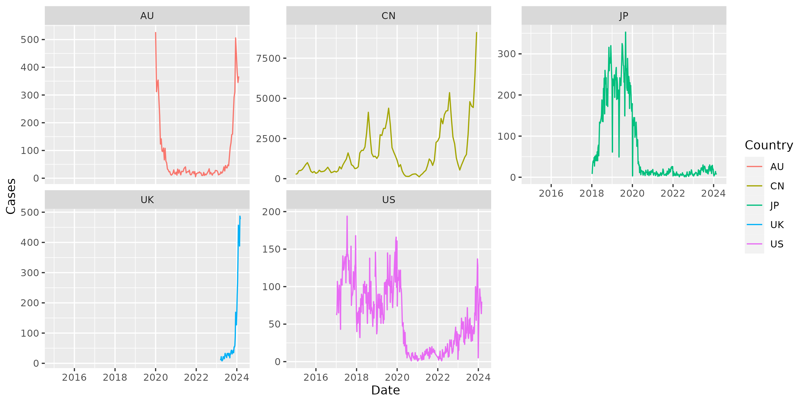

## Introduction

## Data Source

| Country | Country Code | Path | Status | Frequency | Data Source |
| --- | --- | --- | --- | --- | --- |
| Chinese Mainland | CN | [CN](CleanData/CN/pertussis.csv) | Done | Monthly | [National Disease Control and Prevention Administration](https://www.ndcpa.gov.cn/jbkzzx/c100016/common/list.html) |
| USA | US | [US](CleanData/US/pertussis.csv) | Done | Weekly | [National Notifiable Diseases Surveillance System](https://www.cdc.gov/nndss/) |
| Japan | JP | [JP](CleanData/JP/pertussis.csv) | Done | Weekly | [National Institute of Infectious Diseases](https://www.niid.go.jp/niid/en/survaillance-data-table-english.html) |
| UK | UK | [UK](CleanData/UK/pertussis.csv) | Working | Weekly | [data.gov.uk](https://www.data.gov.uk/dataset/e37520b0-ddb4-4cfa-b53f-a9c50ef21965/notification-of-infectious-diseases) |
| Australia | AU | [AU](CleanData/AU/pertussis.csv) | Done | Fortnightly | [National Notifiable Diseases Surveillance System](https://www.health.gov.au/resources/collections/nndss-fortnightly-reports)

> WHO: [Global Health Observatory data repository](https://apps.who.int/gho/data/view.main.1540_43?lang=en)

## Preview

